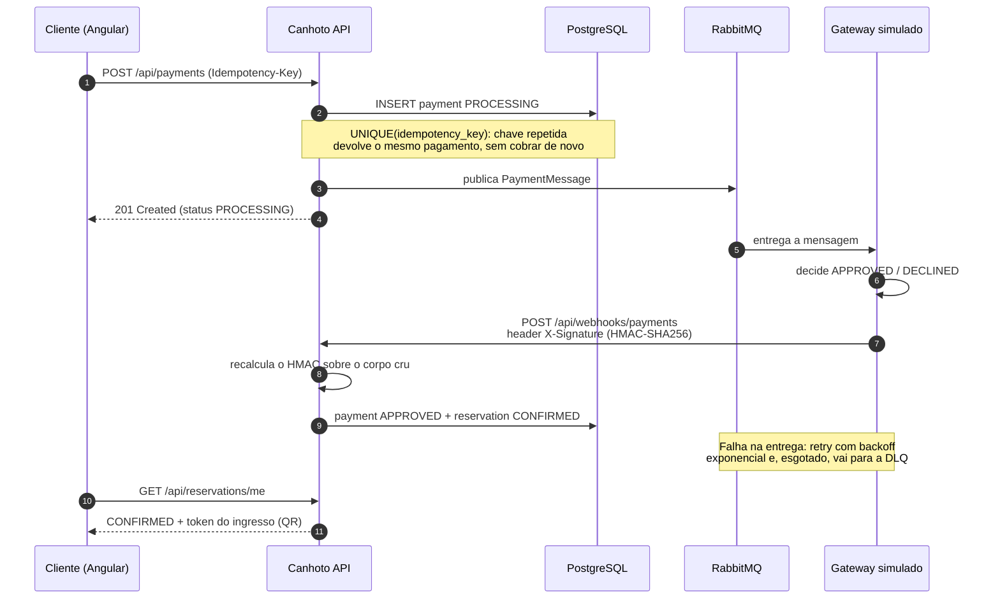

# 🎟️ Canhoto


> **Seu acesso, seu momento. Sem colisão.**


Plataforma de venda de ingressos para eventos, com gateway de pagamento simulado, construída para demonstrar conceitos de engenharia de software em um cenário realista: **autenticação JWT**, **controle de concorrência com lock pessimista**, e **processamento de pagamento assíncrono com mensageria e idempotência**.

> Projeto de portfólio construído de forma incremental em **7 fases, todas concluídas**.

---

## 🔗 Demonstração

**App:** _(preencha com a URL da Vercel após o deploy)_ · **API/Swagger:** _(URL do Render + `/swagger-ui.html`)_

Entre com uma das contas de demonstração — elas já vêm criadas pela migration `V7__seed_demo_data.sql`,
junto com seis eventos e seus setores:

| Perfil | Email | Senha | O que dá para ver |
|---|---|---|---|
| **Organizador** | `organizador@demo.com` | `demo123` | Criar/editar eventos, dashboard de vendas, check-in na portaria |
| **Cliente** | `cliente@demo.com` | `demo123` | Reservar, pagar (Pix/cartão) e receber o ingresso com QR code |

> O backend roda no plano gratuito do Render e hiberna quando fica ocioso: o primeiro
> acesso leva ~50s. A tela avisa enquanto o servidor acorda; as telas seguintes são instantâneas.

### Roteiro sugerido (2 minutos)
1. Entre como **cliente** → escolha um evento → reserve um ingresso (repare no contador de vagas caindo)
2. Em **Minhas Reservas**, clique em **Pagar** → o status vai para `PROCESSING` e o pagamento roda em background
3. Segundos depois a reserva vira `CONFIRMED` → clique em **Ver ingresso** para o QR code
4. Saia, entre como **organizador** → **Painel** mostra a venda → **Validar Ingresso** faz o check-in
5. Tente validar o mesmo ingresso de novo: ele é recusado como `ALREADY_USED`

---

## 📸 Telas

> _Substitua os placeholders abaixo por capturas reais — `docs/marca/` já guarda os
> arquivos de identidade. Um GIF curto do roteiro acima vale mais do que qualquer
> parágrafo deste README._

| Lista de eventos | Ingresso com QR code | Painel do organizador |
|---|---|---|
| _(screenshot)_ | _(screenshot)_ | _(screenshot)_ |

---

## 🧱 Stack

| Camada | Tecnologia |
|---|---|
| **Backend** | Java 21, Spring Boot 3.3, Spring Security, Spring Data JPA, Spring AMQP |
| **Frontend** | Angular 18 (standalone components + Signals), Tailwind CSS |
| **Banco** | PostgreSQL 16 (schema versionado com Flyway) |
| **Mensageria** | RabbitMQ 3.13 |
| **Auth** | JWT (JJWT), BCrypt, autorização por papéis |
| **Infra local** | Docker Compose |

---

## 🏗️ Arquitetura

```
┌─────────────┐   HTTP/JSON   ┌──────────────┐   JDBC   ┌──────────────┐
│  Angular    │ ────────────▶ │ Spring Boot  │ ───────▶ │ PostgreSQL   │
│ (porta 4200)│ ◀──────────── │ (porta 8080) │ ◀─────── │ (porta 5432) │
└─────────────┘   JWT Bearer  └──────┬───────┘          └──────────────┘
                                     │ AMQP
                                     ▼
                              ┌──────────────┐
                              │  RabbitMQ    │  ← gateway de pagamento
                              │ (porta 5672) │    processado em background
                              └──────────────┘
```

O backend segue arquitetura em camadas: `controller` → `service` → `repository`, com DTOs (Java records) isolando as entidades JPA da API pública.

### Fluxo de pagamento

O checkout não espera o gateway. Ele registra a intenção de pagamento, publica uma mensagem e
responde na hora; o resultado volta depois por webhook assinado — o mesmo desenho que Stripe e
Mercado Pago usam com sistemas reais.



---

## 🚀 Rodando localmente

### Pré-requisitos
- Java 21, Node 18+, Docker Desktop

### 1. Subir a infraestrutura
```bash
docker compose up -d
```
- PostgreSQL: `localhost:5432` (banco `canhoto`)
- RabbitMQ Management UI: http://localhost:15672

### 2. Backend
```bash
cd backend
.\mvnw.cmd spring-boot:run   # Windows (PowerShell exige o .\)
mvn spring-boot:run        # Linux/macOS
```
> O wrapper Unix (`./mvnw`) ainda não está versionado — apenas o `mvnw.cmd`.
> Para gerar: `mvn wrapper:wrapper` dentro de `backend/`.
- API: http://localhost:8080
- Swagger UI: http://localhost:8080/swagger-ui.html

No primeiro start o Flyway aplica as migrations V1–V7, e a V7 já popula o banco com os
eventos e as contas de demonstração (`organizador@demo.com` / `cliente@demo.com`, senha `demo123`).

### 3. Frontend
```bash
cd frontend
npm install
npm start
```
- App: http://localhost:4200

---

## 📦 Fases do Projeto

- [x] **Fase 1 — Fundação:** monorepo, Docker, CRUD de eventos, shell Angular
- [x] **Fase 2 — Autenticação:** JWT, papéis (ORGANIZADOR/CLIENTE), setores de ingressos, telas de login/cadastro
- [x] **Fase 3 — Reservas e Concorrência:** lock pessimista (`SELECT ... FOR UPDATE`) contra sobrevenda, expiração automática de reservas, teste de concorrência com 20 threads
- [x] **Fase 4 — Gateway de Pagamento:** checkout assíncrono via RabbitMQ, idempotência (`Idempotency-Key`), confirmação de reserva
- [x] **Fase 5 — Webhooks e Resiliência:** webhook assinado com HMAC-SHA256, retry com backoff exponencial, dead-letter queue (DLQ)
- [x] **Fase 6 — Pós-compra e Painéis:** ingresso com QR code (token HMAC), check-in na portaria, dashboard de vendas do organizador
- [x] **Fase 7 — Qualidade e Deploy:** CI no GitHub Actions, backend dockerizado (Render), frontend (Vercel), Postgres (Neon), RabbitMQ (CloudAMQP)

---

## 💡 Destaques de Engenharia

- **Concorrência segura:** o decremento de assentos usa lock pessimista no PostgreSQL. Um teste de integração dispara 20 threads simultâneas disputando 5 vagas e verifica que exatamente 5 reservas são criadas — provando que não há sobrevenda.
- **Pagamento assíncrono:** o checkout responde imediatamente (`PROCESSING`) e publica uma mensagem no RabbitMQ; um consumidor processa o pagamento em background, desacoplando a operação lenta da requisição HTTP.
- **Idempotência:** uma `Idempotency-Key` (com constraint `UNIQUE` no banco) garante que reenviar o mesmo checkout — por clique duplo ou retry de rede — nunca gera cobrança duplicada.
- **Integridade na edição:** editar um evento reconcilia os setores por id em vez de apagar e
  recriar. Assim as reservas existentes não ficam órfãs, os ingressos já vendidos continuam
  contabilizados, e tentar remover um setor com reservas devolve `409` com a explicação —
  em vez do erro de chave estrangeira que o banco levantaria.
- **Schema versionado:** todo o banco é gerenciado por migrations Flyway; o Hibernate roda em modo `validate` e nunca altera o schema.

---

## 🔄 CI (GitHub Actions)

A cada push/PR, o workflow [`.github/workflows/ci.yml`](.github/workflows/ci.yml) roda:
- **Backend:** sobe Postgres + RabbitMQ como service containers e executa `mvn -B verify` — incluindo os testes de integração (concorrência de reservas, idempotência de pagamento) e os unitários (assinatura de webhook e de ingresso).
- **Frontend:** `npm ci` + suite de testes em Chrome headless + build de produção.
  Os specs ficam fora do build, então rodar só o build deixaria passar um teste quebrado.

---

## ☁️ Deploy

Arquitetura de produção: **Render** (backend Docker) · **Vercel** (frontend) · **Neon** (Postgres) · **CloudAMQP** (RabbitMQ).

> A configuração é toda por variável de ambiente — o Spring Boot sobrescreve qualquer chave do `application.yml` via env (relaxed binding). Veja [`backend/.env.example`](backend/.env.example).

### Variáveis de ambiente do backend (Render)
| Variável | Origem | Exemplo |
|---|---|---|
| `SPRING_PROFILES_ACTIVE` | fixo | `prod` |
| `SPRING_DATASOURCE_URL` | Neon | `jdbc:postgresql://<host>.neon.tech/canhoto?sslmode=require` |
| `SPRING_DATASOURCE_USERNAME` / `_PASSWORD` | Neon | — |
| `SPRING_RABBITMQ_ADDRESSES` | CloudAMQP | `amqps://user:pass@<host>.cloudamqp.com/vhost` |
| `APP_SECURITY_JWT_SECRET_KEY` | você (`openssl rand -base64 32`) | chave Base64 256 bits |
| `APP_WEBHOOK_SECRET` / `APP_TICKET_SECRET` | você | segredos HMAC |
| `APP_WEBHOOK_URL` | URL do próprio backend | `https://<backend>.onrender.com/api/webhooks/payments` |
| `APP_CORS_ALLOWED_ORIGINS` | URL da Vercel | `https://<front>.vercel.app` |

### Passo a passo
1. **Neon** — crie um projeto Postgres, copie a connection string (com `?sslmode=require`) → preenche `SPRING_DATASOURCE_*`. O Flyway aplica as migrations V1–V6 no primeiro start.
2. **CloudAMQP** — crie uma instância *Little Lemur* (free), copie a *AMQP URL* → `SPRING_RABBITMQ_ADDRESSES`.
3. **Render** — *New → Blueprint* (usa o [`render.yaml`](render.yaml)) ou *New → Web Service* com runtime Docker apontando para `backend/Dockerfile`. Preencha as env vars acima e faça deploy. Anote a URL pública.
4. **Vercel** — *Import* o repo, *Root Directory* = `frontend` (o [`vercel.json`](frontend/vercel.json) cuida do build e do roteamento SPA). Deploy e anote a URL.
5. **Fechar o ciclo** — ponha a URL da Vercel em `APP_CORS_ALLOWED_ORIGINS` (Render) e a URL do Render em [`frontend/src/environments/environment.prod.ts`](frontend/src/environments/environment.prod.ts); commit → a Vercel redeploya sozinha.

> O plano free do Render hiberna após inatividade — o primeiro acesso depois de ocioso leva ~50s (cold start).

---

## 📄 Licença

Projeto de estudo/portfólio.
